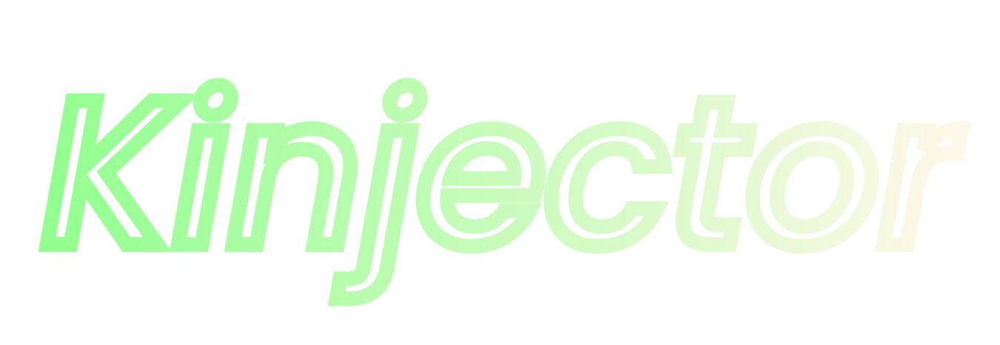

# 
Welcome to

    

---

# Overview

Kinjector is a GUI .dll injector written in go.

This is a part of my K suite of tools that so far includes:

- [Ktool](https://github.com/kociumba/ktool)
- [Ksorter](https://github.com/kociumba/ksorter)

This is a project I started working on because I find these things interesting and thought it would be nice if I had an
injector I could trust.

Once this project becomes more mature I will write a wiki for it like I did for Ktool
but for now all the necessary information is here.

## Installation

The recommended way to install Kinjector is via the [scoop install file](https://raw.githubusercontent.com/kociumba/Kinjector/main/Kinjector.json).  

- install the windows package manager [scoop](https://scoop.sh)
- use `scoop install https://raw.githubusercontent.com/kociumba/Kinjector/main/Kinjector.json` to install Kinjector
- to update Kinjector, use `scoop uininstall Kinjector` and again `scoop install https://raw.githubusercontent.com/kociumba/Kinjector/main/Kinjector.json`

Alternatively you can always compile it from source 

### Credits

This project uses [fyne](https://github.com/fyne-io/fyne) for it's GUI
and [zenity](https://github.com/ncruces/zenity) for native system dialogs where needed.

Full list of used packages and licenses can be found in the app.